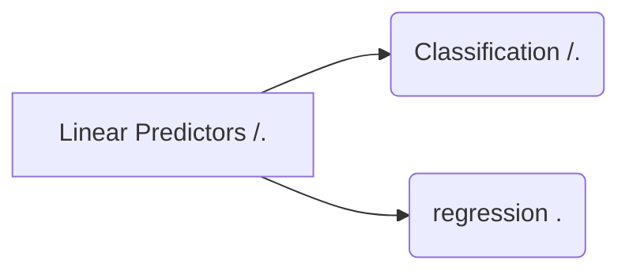

## Linear Predictor

머신러닝 : 인공지능의 한 분야  /  컴퓨터가 학습할 수 있도록 알고리즘과 기술을 개발하는 분야.

가장 쉬운 Machine Learning : Linear Predictors

-- 스팸메일 분류기 --

Input:  이메일 Data
Output : 메일이 스팸인지 아닌지의 여부
<!--stackedit_data:
eyJoaXN0b3J5IjpbLTc5NTI3NDc4OCw5MDg0Njk4MTcsLTY1Nz
UyNzA3OCwxNTEwMjU2MjY0LC01OTg3NjkxNjQsMTg1MzUyMjQw
OSwtMjA4ODc0NjYxMl19
-->