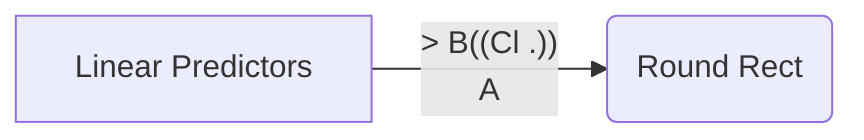

## Linear Predictor

머신러닝 : 인공지능의 한 분야  /  컴퓨터가 학습할 수 있도록 알고리즘과 기술을 개발하는 분야.

가장 쉬운 Machine Learning : Linear Predictors

<!--stackedit_data:
eyJoaXN0b3J5IjpbLTg4MjQzNjMyOCwtNjU3NTI3MDc4LDE1MT
AyNTYyNjQsLTU5ODc2OTE2NCwxODUzNTIyNDA5LC0yMDg4NzQ2
NjEyXX0=
-->