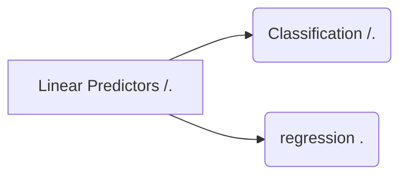

## Linear Predictor

머신러닝 : 인공지능의 한 분야  /  컴퓨터가 학습할 수 있도록 알고리즘과 기술을 개발하는 분야.

> 예측  
> 
> 개선
> 
> 자동화

### 1 Reflex Model : 반응형 모델

가장 쉬운 Machine Learning : Linear Predictors

prediction의 종류

Classification : 등급화  (학점 시스템, True or False)

Ranking : 순위화 

Regression : 수치화 / 구조화  (개미의 주식가격 예측,  문자열 번역 )

-- 스팸메일 분류기 --

입력 :  이메일 Data
출력 :  True of False
목적 : 분류기 f(함수) 추출

<!--stackedit_data:
eyJoaXN0b3J5IjpbLTEwNDc3NTk1MzgsMTE3MTMzMDgyLDkwOD
Q2OTgxNywtNjU3NTI3MDc4LDE1MTAyNTYyNjQsLTU5ODc2OTE2
NCwxODUzNTIyNDA5LC0yMDg4NzQ2NjEyXX0=
-->