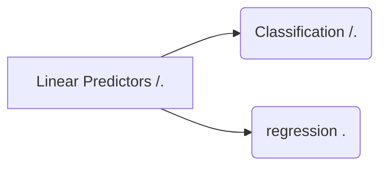

## Linear Predictor

머신러닝 : 인공지능의 한 분야  /  컴퓨터가 학습할 수 있도록 알고리즘과 기술을 개발하는 분야.

가장 쉬운 Machine Learning : Linear Predictors

-- 스팸메일 분류기 --

입력 :  이메일 Data
출력 :  True of False
목적 : 분류기 f(함수) 추출

<!--stackedit_data:
eyJoaXN0b3J5IjpbMTM2ODI1NzA2NywxMTcxMzMwODIsOTA4ND
Y5ODE3LC02NTc1MjcwNzgsMTUxMDI1NjI2NCwtNTk4NzY5MTY0
LDE4NTM1MjI0MDksLTIwODg3NDY2MTJdfQ==
-->